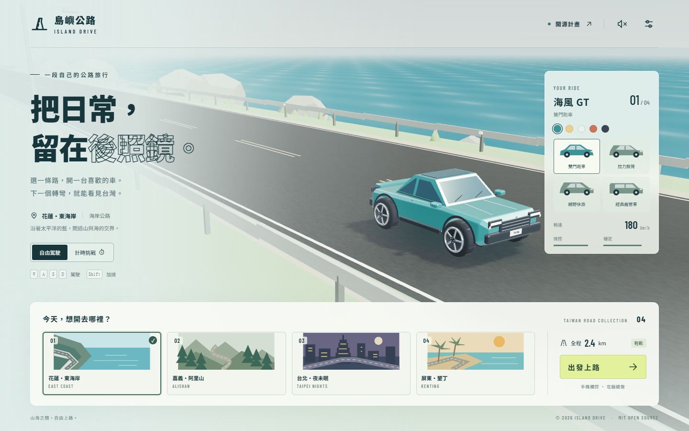

# 島嶼公路｜ISLAND DRIVE

一款可以用手機瀏覽器玩的 3D 台灣公路駕駛遊戲。挑選路線、車種與車色，玩自由駕駛或計時挑戰。車輛與道路旁的模型由 Blender 建模，匯出 GLB 後交給 Three.js 呈現；原始 `.blend`、建模腳本、遊戲程式與製作步驟都包含在專案內。

本專案採 MIT 授權，可以修改、再散布及商業使用。原始碼與 Blender 模型公開於 [GitHub](https://github.com/mars-tw/taiwan-island-drive)，遊戲使用 GitHub Pages 提供 HTTPS 手機版；目前尚未上架 App Store 或 Google Play。

**[直接玩島嶼公路](https://mars-tw.github.io/taiwan-island-drive/)** · [下載完整開源專案](https://mars-tw.github.io/taiwan-island-drive/downloads/island-drive-source.zip)

手機可直接開啟遊戲網址。Android 可選「安裝應用程式」，iPhone 可在 Safari 分享選單選擇「加入主畫面」。第一次連網完整載入後，即可使用離線功能。電腦不需要保持開機。



## 遊戲內容

| 路線 | 風景 | 距離 |
| --- | --- | --- |
| 花蓮・東海岸 | 海岸公路、山海交界 | 2.4 公里 |
| 嘉義・阿里山 | 森林山道、薄霧 | 2.4 公里 |
| 台北・夜未眠 | 城市建築、夜間燈光 | 2.4 公里 |
| 屏東・墾丁 | 南國海線、椰子樹 | 2.4 公里 |

| 車種 | 類型 | 最高速度設定 |
| --- | --- | --- |
| 海風 GT | 雙門跑車 | 180 km/h |
| 山岳 RS | 拉力掀背 | 160 km/h |
| 旅人 X | 越野休旅 | 140 km/h |
| 漫遊號 | 經典露營車 | 120 km/h |

最高速度是遊戲參數；轉向、路外減速、碰撞與加速會影響實際速度。四條路線都是依台灣風景創作的原創道路，沒有使用 GIS、衛星圖或真實道路測繪資料。

## 直接玩交付版本

下載包已包含建置好的 `dist/`。電腦有 Node.js 時，Windows 可以直接雙擊 `開始遊戲.cmd`，瀏覽器會開啟 `http://localhost:5178`，不需要先安裝 npm 依賴。

其他系統或偏好終端機的使用者，可在專案根目錄執行：

```sh
node scripts/serve.mjs
```

遊玩期間保留伺服器視窗，按 `Ctrl+C` 即可停止。這個伺服器也接受同一區域網路的手機連線。

## 開發專案

需要 Node.js 22.12 以上版本與 npm。交付環境使用 Node.js 24.15.0。下載包已包含 GLB，先玩遊戲不需要安裝 Blender。

```sh
cd taiwan-island-drive
npm install
npm run dev
```

開啟 `http://localhost:5178`。重現鎖定的依賴版本時，可以用 `npm ci` 取代 `npm install`。

手機與電腦連上同一個區域網路後，用手機瀏覽器開啟 `http://電腦的區網IP:5178`，例如 `http://192.168.1.20:5178`。開發伺服器已綁定 `0.0.0.0`；電腦防火牆若擋住 Node.js 的私人網路連線，需要允許該連線。網址中的 `localhost` 只指向目前使用的裝置，手機上要改成電腦的 IP。

```sh
npm test
npm run build
npm run preview
```

`npm run build` 會產生 `dist/` 與離線預載清單 `dist/precache.json`。正式版可交給任何能提供靜態檔案的 HTTPS 伺服器；`npm run preview` 供本機驗收。不要直接用 `file://` 開啟 HTML，GLB 與模組需要透過 HTTP 載入。

如果放在網站子目錄，可以在建置時指定 base，再產生離線清單：

```sh
npx vite build --base=/island-drive/
node scripts/write-precache.mjs
```

將整個 `dist/` 放到 `/island-drive/`。模型、下載連結及 Service Worker 以應用程式的 base 路徑載入，不需要把專案放在網域根目錄。

## 手機與離線使用

遊戲提供觸控操作，建議將手機橫放。桌面也可用鍵盤操作；確切按鍵與操作說明顯示在遊戲內。

手機也可以當方向盤：在「駕駛設定」啟用「手機方向盤」，允許方向感測後，左右傾斜手機轉向，右手按油門與煞車。開車時可用方向盤按鈕切換，點「回正」重新設定直行角度。此功能需要 HTTPS 與支援的手機感測器；未取得權限或沒有資料時會保留觸控操作。操作、實作及驗證範圍見 [docs/TILT.md](docs/TILT.md)。

正式版附 PWA manifest 與 Service Worker。第一次完整載入後，Worker 會預載建置清單內的程式、介面與模型；安裝完成後，重新整理即可測試離線遊玩。原始碼 ZIP 不列入離線快取。

Service Worker 和 PWA 安裝需要安全來源：公開網址使用 HTTPS，本機可使用 `localhost`。一般區域網路的 `http://192.168.x.x` 可玩遊戲，但不具備 HTTPS 的離線安裝能力。開發模式不註冊 Service Worker，避免開發檔案被舊快取覆蓋。

支援的 Android 瀏覽器可從選單安裝應用程式；iPhone 可用 Safari 的「分享」→「加入主畫面」。安裝選項依瀏覽器與系統版本而異。這份交付沒有原生 App 封裝、簽章或商店上架流程。

## Blender 原始模型與再生

原始模型在 `blender/island-drive.blend`。建模腳本在 `blender/build_assets.py`，輸出位於 `public/models/`，包含四台車、椰子樹、杉木、城市建築及道路標誌。生成器使用專案相對路徑，不依賴交付電腦的帳號或磁碟位置。

以下指令需先在專案根目錄執行，並讓 `blender` 位於 PATH：

```sh
blender --background --python blender/build_assets.py
npm run build
```

Windows 若未設定 PATH，可直接指定安裝位置：

```powershell
& 'C:\Program Files\Blender Foundation\Blender 5.2\blender.exe' --background --python blender/build_assets.py
```

本機製作使用 Blender 5.2.0 LTS。生成器會建立 `.blend`、匯出 GLB、寫入 `public/models/manifest.json`，並輸出 `docs/vehicles.png` 作為模型檢視圖。修改建模腳本後，重新執行生成器與前端建置，才能更新遊戲使用的模型。

## 原始碼下載包

Windows PowerShell 可在專案根目錄建立交付包：

```powershell
powershell -ExecutionPolicy Bypass -File scripts/package-source.ps1
```

輸出為 `release/island-drive-source.zip`，內容包括程式、MIT 授權、Blender 腳本與 `.blend`、GLB，以及可直接託管的 `dist/`。腳本會確認 Blender 原檔、GLB 與正式版存在；不打包 `node_modules`、`.audit-tmp`、下載包本身、密鑰檔或 Blender 備份。先執行 `npm run build` 再打包。

## 自動部署

`.github/workflows/pages.yml` 會在 `main` 更新後安裝鎖定的依賴、執行測試、建置離線遊戲、製作完整開源下載包，再部署到 GitHub Pages。Blender 資產已隨原始碼提供，雲端建置不用另行安裝 Blender。

自行 fork 後，請在 GitHub 儲存庫的 Settings → Pages 將來源選為 GitHub Actions，再執行工作流程。網站使用相對路徑，可部署在儲存庫子目錄；README 中的專案與遊戲網址需要改成自己的帳號。

遊戲中的「下載原始碼」使用 `downloads/island-drive-source.zip`。若自己重製此按鈕的下載檔，打包後複製到 `public/downloads/` 與 `dist/downloads/`；ZIP 內容不包含這兩個下載目錄，可避免重複打包。

## 專案結構

```text
src/                  選單、3D 場景、駕駛模擬、遊戲設定
public/models/        Blender 匯出的 GLB 與資產清單
public/sw.js          正式版離線快取
blender/              原始 .blend 與模型再生腳本
tests/physics.test.js 駕駛模擬與遊戲時鐘的確定性測試
scripts/              離線清單與原始碼打包
docs/                 製作紀錄、模型圖與驗收結果
dist/                 npm run build 產出的靜態網站
```

驗收證據與尚未驗證的範圍見 [docs/QA.md](docs/QA.md)，參與方式見 [CONTRIBUTING.md](CONTRIBUTING.md)。專案自製程式與 Blender 資產皆採 [MIT](LICENSE)。Three.js 保留其 MIT 授權；遊戲內附的 Barlow Condensed 字型採 SIL Open Font License 1.1，完整著作權與授權原文在 [public/THIRD_PARTY_NOTICES.txt](public/THIRD_PARTY_NOTICES.txt)，正式版也包含這份文件。Vite 等開發依賴保留各自的授權。
